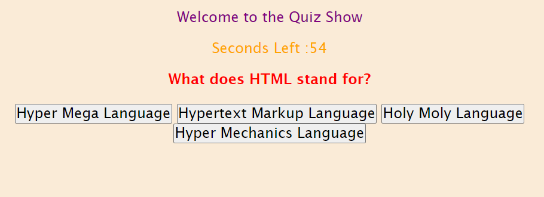

# api-quiz-game

## Description

This project is to utilize javascript to create a quiz game.

- The motivation for this project was to further refine my javascript skills.
- I built this project as an example of different usages of javascript including clicking buttons and choosing options.
- This problem solves concepts of choosing correct and incorrect answers. 
- I learned different methods to use if and else statements in js.

## Usage

This project can be used not only as a small study tool but as a demonstration of diffent js techniques.

To add a screenshot, create an `assets/images` folder in your repository and upload your screenshot to it. Then, using the relative filepath, add it to your README using the following syntax:

    
    

## Credits

Credit is due to Tabitha Salmon, Juliana Lamond, Sean Dillon, and Freddy Kwak as they are members of my study group and were helpful in collaboration. 

## License

MIT License

Copyright (c) [2022] [Joshua Rae]

Permission is hereby granted, free of charge, to any person obtaining a copy
of this software and associated documentation files (the "Software"), to deal
in the Software without restriction, including without limitation the rights
to use, copy, modify, merge, publish, distribute, sublicense, and/or sell
copies of the Software, and to permit persons to whom the Software is
furnished to do so, subject to the following conditions:

The above copyright notice and this permission notice shall be included in all
copies or substantial portions of the Software.

THE SOFTWARE IS PROVIDED "AS IS", WITHOUT WARRANTY OF ANY KIND, EXPRESS OR
IMPLIED, INCLUDING BUT NOT LIMITED TO THE WARRANTIES OF MERCHANTABILITY,
FITNESS FOR A PARTICULAR PURPOSE AND NONINFRINGEMENT. IN NO EVENT SHALL THE
AUTHORS OR COPYRIGHT HOLDERS BE LIABLE FOR ANY CLAIM, DAMAGES OR OTHER
LIABILITY, WHETHER IN AN ACTION OF CONTRACT, TORT OR OTHERWISE, ARISING FROM,
OUT OF OR IN CONNECTION WITH THE SOFTWARE OR THE USE OR OTHER DEALINGS IN THE
SOFTWARE.

# Link

https://github.com/joshuar2155/api-quiz-game